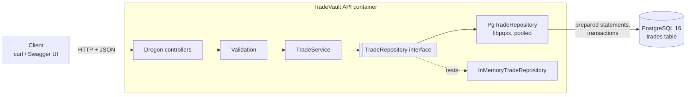

# TradeVault — C++20 Trade-Capture Microservice


TradeVault is a REST service that records financial trades (instrument, quantity, price, counterparty, timestamps), validates them against business rules, and stores them in PostgreSQL. The whole system starts with one `docker compose up`, and every pull request is built, tested, and scanned by CI before it can merge.

**Status: milestones M0–M4 of 9 are complete.** The service is a working, containerized, tested API with durable storage. Event publishing, observability, load testing, and cloud deployment are on the [roadmap](#roadmap).

---

## Purpose

I built TradeVault to learn how banks write the software behind their trading desks and which technologies those systems rely on.

When a trader executes a deal, the trade has to be *captured*: recorded once, checked against business rules, stored durably, and passed on to the systems that handle risk, settlement, and compliance. Trade capture is a core part of that flow, and it carries requirements that ordinary web apps can usually relax:

- **A trade must never be booked twice.** Networks fail and clients retry, so booking has to be idempotent.
- **A trade must never be lost or half-written.** Every write has to be all-or-nothing.
- **Every change must be traceable.** Regulators and auditors need to know what happened and when.
- **The system has to keep running.** It has to be tested, monitored, and deployable without manual steps.

Each milestone of this project takes one of those requirements and the technology commonly used to meet it:

| Requirement | Technology I used to learn it | Milestone |
|---|---|---|
| Fast, predictable services | **C++20**, the language much bank trading infrastructure is written in | M0–M2 |
| A clear contract between systems | **REST + OpenAPI**, with standard error responses | M2 |
| Durable, consistent records | **PostgreSQL** with transactions, constraints, and versioned migrations (the same SQL skills apply to SQL Server and Oracle) | M3 |
| Identical environments everywhere | **Docker** and **Docker Compose** | M4 |
| No untested code in production | **GitHub Actions** CI, **GoogleTest**, static analysis, image scanning | M0–M4 |

This is a learning project modeled on publicly described trade-capture systems and industry practice. It is not a copy of any bank's internal code.

---

## Why it is built this way

Most of the decisions in this repo come from one goal: build a service the way a bank's engineering team would run it in production, not just code that works on one laptop.

| Decision | Why |
|---|---|
| **C++20 for a web service** | Much of the trading infrastructure at banks is written in C++. Writing the HTTP layer, persistence, and tooling in C++ (rather than reaching for Python) taught me how that ecosystem works end to end. |
| **Contract first (OpenAPI before code)** | Clients get one documented contract, and the spec doubles as interactive docs through Swagger UI. The implementation is checked against the spec, not the other way around. |
| **`Result<T, E>` instead of exceptions at the boundary** | Every failure path is visible in the function signature and has to be handled. No exception can escape to the HTTP layer as an unexplained 500. |
| **Injected repository interface** | Business logic depends on `TradeRepository`, not on a database. That let me build and test the domain with an in-memory store first, then swap in PostgreSQL in M3 without changing the service. |
| **Unique `trade_id` supplied by the client** | Network clients retry. A database constraint makes `POST` idempotent: a retried booking returns `409 Conflict` instead of booking the trade twice. |
| **Prepared statements only** | User input is never concatenated into SQL, which closes off SQL injection by construction. |
| **Versioned SQL migrations** | The schema is versioned in Git like the code, so any environment can be rebuilt to the same state. |
| **Multi-stage, non-root Docker image** | The runtime image ships only the binary and its libraries, not the compiler, and does not run as root. |
| **Healthcheck-gated startup** | The API waits until Postgres actually accepts connections, not merely until its container starts. |
| **CI blocks merges** | `main` is protected, so nothing lands without a green build, passing tests, a clean lint, and an image scan. |

---

## Quickstart

**Prerequisites:** Docker with the Compose plugin. Nothing else.

```bash
git clone https://github.com/alankhal/tradevault.git
cd tradevault
cp .env.example .env
docker compose up --build
```

The API listens on `http://localhost:8080` (configurable in `.env`). Swagger UI is served at `/docs`.

Book, fetch, list, and cancel a trade:

```bash
# Create
curl -s -X POST http://localhost:8080/v1/trades \
  -H 'Content-Type: application/json' \
  -d '{
        "trade_id": "T-1001",
        "instrument": "AAPL",
        "side": "BUY",
        "quantity": 100,
        "price": 189.25,
        "counterparty": "CPTY-42",
        "trade_time": "2026-10-06T14:30:00Z"
      }'

# Fetch one
curl -s http://localhost:8080/v1/trades/T-1001

# List (paginated)
curl -s 'http://localhost:8080/v1/trades?limit=20&offset=0'

# Cancel
curl -s -X POST http://localhost:8080/v1/trades/T-1001/cancel

# Retrying the same POST returns 409, not a second trade
```

A full walkthrough is in [`scripts/demo.sh`](scripts/demo.sh).

---

## API

The contract lives in [`openapi.yaml`](openapi.yaml).

| Method | Path | Success | Errors |
|---|---|---|---|
| `POST` | `/v1/trades` | `201 Created` | `400` invalid trade, `409` duplicate `trade_id` |
| `GET` | `/v1/trades/{id}` | `200 OK` | `404` unknown id |
| `GET` | `/v1/trades` | `200 OK` | `400` bad pagination params |
| `POST` | `/v1/trades/{id}/cancel` | `200 OK` | `404` unknown id, `409` already cancelled |
| `GET` | `/healthz` | `200 OK` | `503` database unreachable |

### Error format

Every error uses [RFC 7807](https://www.rfc-editor.org/rfc/rfc7807) `application/problem+json`, so clients parse one shape for every failure:

```json
{
  "type": "https://tradevault.dev/problems/validation",
  "title": "Validation failed",
  "status": 400,
  "detail": "quantity must be greater than 0",
  "instance": "/v1/trades"
}
```

Domain errors map to HTTP status in exactly one place:

| Domain error | HTTP status |
|---|---|
| `ValidationError` | 400 |
| `NotFound` | 404 |
| `Conflict` (duplicate id, invalid state change) | 409 |
| Anything unexpected | 500 (logged with request id, no internals leaked) |

---

## Architecture (current: M0–M4)



- **Controllers** translate HTTP and JSON to domain calls and domain errors to problem responses. No business logic lives here.
- **`tradevault_core`** is a library with the `Trade` type, validation rules, and `TradeService`. It has no I/O, which keeps it fast to unit test.
- **`TradeRepository`** is the seam. `InMemoryTradeRepository` backs the unit tests; `PgTradeRepository` backs the running service. Which one is used is set by configuration.

### Persistence

- Migrations in [`db/migrations/`](db/migrations) are numbered SQL files applied in order and are safe to re-run.
- `trade_id` carries a `UNIQUE` constraint; a violation is translated to `Conflict` → `409`.
- All queries are prepared statements with bound parameters.
- Writes run inside transactions, so a failure mid-operation leaves no partial rows.
- A small connection pool avoids opening a new connection for each request.

### Containers

- [`Dockerfile`](Dockerfile) has two stages: a build stage with the full toolchain and vcpkg, and a slim runtime stage that copies in only the binary and runs as an unprivileged user.
- [`docker-compose.yml`](docker-compose.yml) runs the API and Postgres. Postgres has a healthcheck, and the API uses `depends_on: condition: service_healthy`.
- Configuration comes from environment variables (see [`.env.example`](.env.example)). No secrets are baked into the image.

---

## Development

### Toolchain

- C++20 compiler: GCC 13+ or MSVC 2022
- CMake 3.25+
- [vcpkg](https://github.com/microsoft/vcpkg) in manifest mode (dependencies pinned in [`vcpkg.json`](vcpkg.json))

### Build and test locally

```bash
cmake --preset debug
cmake --build --preset debug
ctest --preset debug            # unit tests, no database required
```

Integration tests run against the Compose stack:

```bash
docker compose up -d --wait
ctest --preset integration
docker compose down -v
```

### Repository layout

| Path | Contents |
|---|---|
| `src/core/` | `tradevault_core`: domain model, validation, service, repository interface |
| `src/api/` | Drogon controllers, JSON mapping, error-to-problem mapping |
| `src/db/` | `PgTradeRepository`, connection pool |
| `db/migrations/` | Versioned SQL migrations |
| `tests/unit/` | GoogleTest unit tests (no I/O) |
| `tests/integration/` | Repository and API tests against real Postgres |
| `openapi.yaml` | API contract |
| `docs/adr/` | Architecture Decision Records |
| `.github/workflows/` | CI pipeline |

---

## Testing and quality

| Level | What it covers | Runs |
|---|---|---|
| Unit | Every validation rule and boundary value, error mapping, JSON mapping | Every PR, Linux (GCC) + Windows (MSVC) |
| Integration (DB) | CRUD round-trip, duplicate `trade_id` → conflict, rollback on failure, migrations re-run cleanly | Every PR, against a Postgres container |
| Integration (API) | `201` happy path, `400` malformed JSON with problem body, `404`, `409` | Every PR, against the Compose stack |
| Static analysis | clang-tidy, clang-format check | Every PR |
| Image scan | Trivy, fails on critical CVEs | Every PR |

The suite currently has **45+ GoogleTest tests**.

### CI pipeline

```
PR opened ─► build (GCC + MSVC) ─► format + clang-tidy ─► unit tests
          ─► docker compose up ─► integration tests ─► compose down
          ─► build image ─► Trivy scan
merge to main ─► publish image to GHCR
```

`main` is branch-protected; a red check blocks the merge button.

---

## Roadmap

| Milestone | Scope | Status |
|---|---|---|
| M0 | CMake + vcpkg scaffold, GoogleTest, clang-tidy/format, CI | ✅ Done |
| M1 | Domain model, validation, in-memory service, unit tests | ✅ Done |
| M2 | Drogon REST API, OpenAPI contract, problem+json errors | ✅ Done |
| M3 | PostgreSQL repository, migrations, pooling, idempotent booking | ✅ Done |
| M4 | Multi-stage Docker image, Compose stack, in-stack CI tests, GHCR | ✅ Done |

## License

MIT